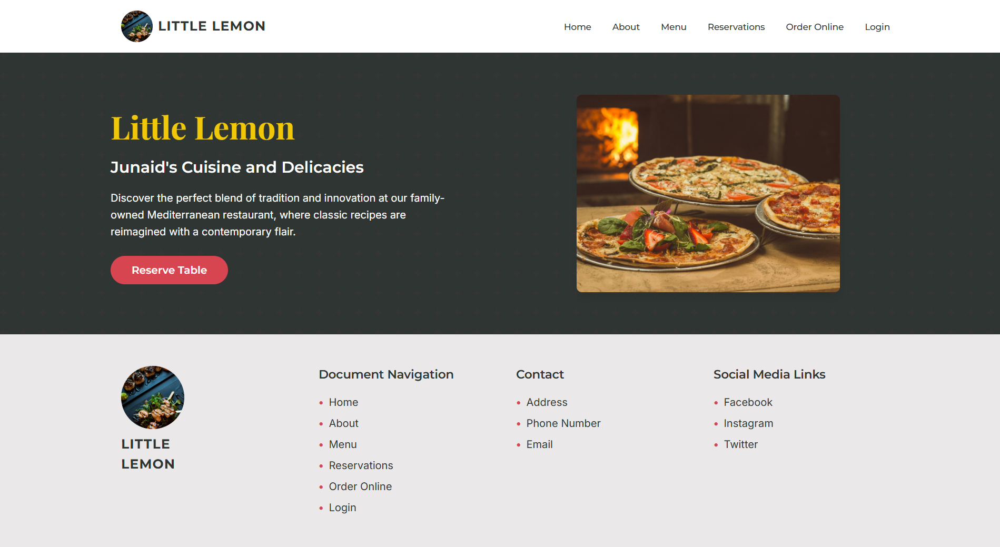
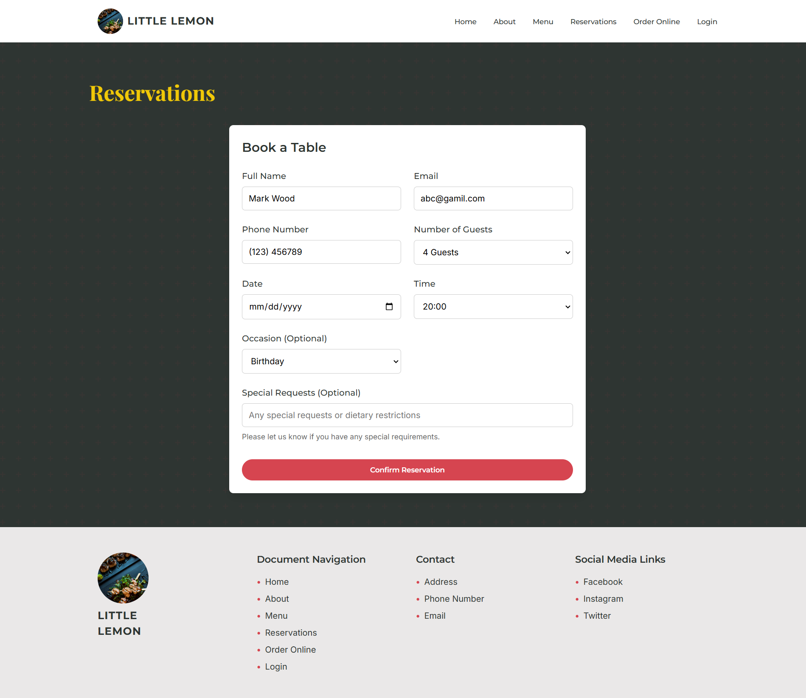
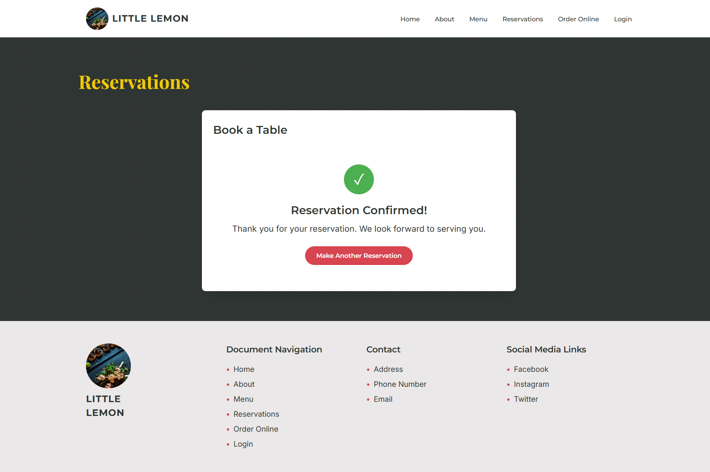

# Meta Professional Certificate Capstone Project  

## Final Project View


## Table Reservation Form


## Booking Confirmation


This repository contains the **capstone project** for the **Meta Front-End Developer Professional Certificate**.  

## 📌 Project Overview  

The project is built for **Little Lemon Restaurant**, where a new feature has been implemented to allow users to **reserve a table**. This enhances the user experience by providing an easy and efficient way to book tables online.  

## 🚀 Running the Project Locally  

Follow these steps to set up and run the project on your local machine:  

### 1️⃣ Clone the Repository  
```sh
git clone https://github.com/InfinityTO/Meta-Professional-Certificate-Capstone-Project.git
```
```sh

cd Meta-Professional-Certificate-Capstone-Project
```

### 2️⃣ Install Dependencies
```sh
npm install
```
### 3️⃣ Start the Project
```sh
npm start
```

Now, open your browser and go to http://localhost:3000/ to see the project in action.
